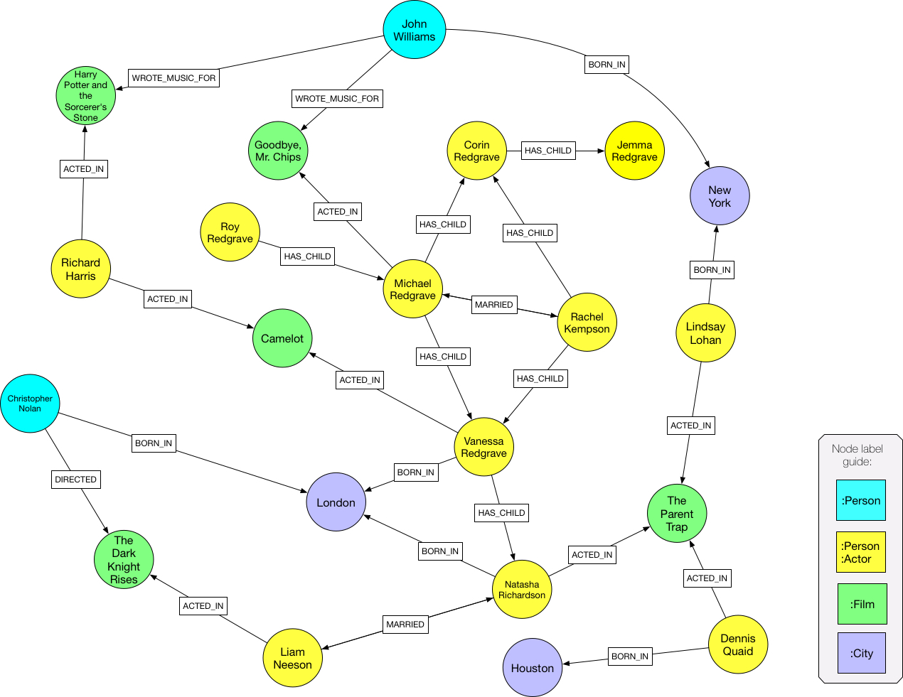

= CIP2017-01-18 Configurable Pattern Matching Semantics
:numbered:
:toc:
:toc-placement: macro
:source-highlighter: codemirror

*Authors:*

 * Stefan Plantikow <stefan.plantikow@neo4j.com>
 * Mats Rydberg <mats.rydberg@neo4j.com>
 * Petra Selmer <petra.selmer@neo4j.com>

This proposal is a response to link:https://github.com/opencypher/openCypher/issues/174[CIR-2017-174].

toc::[]

== Motivation

Currently Cypher uses pattern matching semantics that treats _all_ patterns that occur in a `MATCH` clause as a unit (called a *uniqueness scope*) and only considers pattern instances that bind different relationships to each fixed length relationship pattern variable and to each element of a variable length relationship pattern variable.
This has come to be called *Cypermorphism* informally and is a form of edge isomorphism that is based on Cypher's notion of uniqueness scope.

Cyphermorphism lies at the intersection of returning as many results as possible while still ruling out returning an infinite number of paths when matching graphs that contain cycles with a variable length pattern.

However, the notion of uniqueness scope has proven to be non-standard and is occasionally confusing for users and cyphermorphic matching is not tractable in terms of computational complexity for some graphs.

The CIP aims to address these issues.

== Background

This CIP is based upon the notions of _walks_, _trails_ and _paths_, as defined by _Jungnickel_ <<Jung10>>.
We note that walks, trails and paths are not universally used, and correspond to _paths_, _simple paths_ and _tidy paths_ as defined by _Rosen_ <<Rose02>>.
However, we use Jungnickel's definitions as the terms lend themselves better from a syntactic perspective.

We define and provide an example for each of these terms below.
In general, we note that every path is a trail, and every trail is a walk.

Assume graph `G` is given as follows:

For the remainder of this CIP, we use the notation `r^-^` to indicate that a relationship `r` was traversed in the inverse direction; i.e. that `r` was traversed from its target node to its source node.

[[walks]]
=== Walk

A walk is an arbitrary, non-empty sequence of alternating nodes and relationships that starts with a node and ends with a node.
Within a walk, both nodes and edges can be duplicated.
A walk whose start node and end node is the same is called a **closed walk**.

A valid walk in `G` is given by the sequence `S~1~`: `B, t, C, v, D, w, E, w^-^, D, v^-^, C, t^-^, B, s^-^, A`.

We note that `S~1~` contains the duplicated nodes `B`, `C` and `D`, and the duplicated relationships `t`, `v` and `w`.
Moreover, `S~1~` is not a _closed_ walk, as `B` (the start node) ≠ `A` (the end node).

A walk corresponds to the standard definition of _homomorphic_ graph pattern matching.

[[trails]]
=== Trail

A trail is a walk that does not contain any duplicate relationships.

A valid trail in `G` is given by the sequence `S~2~`: `B, t, C, v, D, w, E, x, F, y^-^, D, u, C`.

We note that `S~2~` contains the duplicated notes `C` and `D`, and no duplicate relationships.
Moreover, `S~2~` is not a **closed trail**, as `B` (the start node) ≠ `C` (the end node).
`S~2~` is also a walk.

A path corresponds to the standard definition of _(relationship-)isomorphic_ graph pattern matching as well as the notion of _Cyphermorphic_ graph pattern matching.

[[paths]]
=== Path

A path is a trail that does not contain the same node twice unless that node is both the start node and the end node of the path.

A valid path in `G` is given by the sequence `S~3~`: `B, t, C, v, D, y, F, z, A, s, B`.

We note that `S~3~` contains no duplicated relationships, and that there are no duplicated nodes other than `B`.
However, as `B` is both the start node and end node, `S~3~` is still a valid path, and is, in fact, an example of a **closed path**.
`S~3~` is also an example of a _closed_ walk and a _closed_ trail.

A path corresponds to the standard definition of _(node-)isomorphic_ graph pattern matching.

== Proposal

This CIP has been submitted in the belief that *CIP2017-02-06 Path Pattern Queries* will be accepted and is aligned with it.

[[syntax]]
=== Syntax

Below is outlined the syntactical changes proposed in this CIP.
Note that path patterns are assumed from the *CIP2017-02-06 Path Pattern Queries*.

.Overview of proposed grammar changes:
[source,ebnf]
----
!! Clause-level argument
Pattern = PatternGroup, { PatternGroupWithModifiers }
        | { PatternGroupWithModifiers }-
        ;

PatternGroup = PatternPart, { ',', PatternPart } ;

!! Expected to form a connected component
PatternPart = NamedPatternPart
            | AnonymousPatternPart
            ;

NamedPatternPart = PatternVariableSpec, AnonymousPatternPart ;

AnonymousPatternPart = {
                         NodePattern,
                         { (EdgePattern | PathPattern), NodePattern }
                       }-
                     ;

PathVariableSpec = [ [ PathClassModifier ], PathClass ], [ Variable, '=' ] ;

PathClassModifier = ('OPEN' | 'CLOSED'), 'DIRECTED'
                  | 'DIRECTED'
                  ;

PathClass = 'WALK'
          | 'TRAIL'
          | [ 'SIMPLE' ], 'PATH'
          ;

PatternGroupWithModifiers = PatternGroupModifiers, PatternGroup ;

PatternGroupModifiers =
    PatternQuantifier [ PatternLengthRestriction] [ PatternMorphism ]
  | PatternLengthRestriction [ PatternMorphism ]
  | PatternMorphism
  ;

PatternQuantifier = 'ANY'
                  | 'EACH' [ 'OF' ] !! For readability
                  ;

PatternLengthRestriction = 'SHORTEST'
                         | 'CHEAPEST'
                         | 'UNRESTRICTED'
                         ;

PatternMorphism = 'DIFFERENT', ('NODES' | 'VERTICES')
                | 'DIFFERENT', ('RELATIONSHIPS' | 'EDGES')
                | 'DIFFERENT', [ VariableList ]
                | 'LENIENT'
                ;

VariableList = '(', Variable, { ',', Variable }, ')' ;

Expression = ...
           | 'DIFFERENT', VariableList
           | 'DISJOINT', VariableList
           ;
----

Basic patterns in Cypher consist of a comma-separated list of *pattern parts*, where a pattern part is exemplified by `p = (e:Employee)-[:REPORTS_TO*1..3]->(m:Manager)`.
Pattern parts may be bound to a variable, such as `p` in our example, and consist of a linear chain of connected node, relationship, and path patterns.

While Cypher allows omitting path, node, and relationship variables in a pattern, this is just syntactic sugar; i.e. all parts of a pattern should be considered to be bound to a variable name from the viewpoint of pattern matching semantics (names are either provided in the query or automatically generated by a conforming implementation).

=== Deprecations

This CIP proposes to replace the notion of *uniqueness scope* and *Cyphermorphism* and all associated rules with new, configurable pattern matching semantics.

As proposed in *CIP2017-02-06 Path Pattern Queries*, support for binding relationship list variables in variable length patterns will be deprecated.

This CIP proposes to deprecate the existing syntax for both `shortestPath` and `allShortestPaths` matching of Cypher.

=== Basic pattern matching semantics

Each pattern consists of one or more top-level pattern parts that are given in a comma separated list.

.Query 3.3.1
[source,cypher]
----
MATCH (a)-->(b), (c)<--(d)
RETURN *
----

The solution (set of successful matches) of a pattern is the cross product over the solutions of all its top-level pattern parts.
Thus, if we ignore uniqueness, Query 3.3.1 is semantically equivalent to Query 3.3.2.

.Query 3.3.2
[source,cypher]
----
MATCH (a)-->(b)
// sequence of matches acts like a cross product
// for each incoming row with a and b, find all matches (c)<--(d)
MATCH (c)<--(d)
RETURN *
----

Binding several nodes or relationships in a pattern to the same variable describes an implicit join.
Thus, queries 3.3.3 and 3.3.4 are semantically equivalent.

.Query 3.3.3
[source,cypher]
----
MATCH (a)-->()<--(a)-->(b)
RETURN a
----

.Query 3.3.4
[source,cypher]
----
MATCH (n1)-->(n2), (n3)<--(n4), (n5)-->(b)
WHERE n1 = n4 AND n2 = n3 AND n4 = n5
RETURN n1 AS a
----

=== Flexible pattern part syntax

This CIP proposes to allow breaking of pattern parts using whitespace in order to aid visual layout of longer patterns.

.Query 3.4.1
[source,cypher]
----
MATCH
  p=(a)-->(n2)-->(n3)
    (n3)<--(n4)<--(n5)-->(b)
RETURN *
----

=== Pattern variables and classes

This CIP proposes to name the variable to which a pattern part may be assigned a *pattern variable*.
Note that pattern variables are always bound to a connected sequence of node, relationship, and path patterns (see <<syntax>>).

.In the query, `p` and `q` are examples of pattern variables. A named path pattern `foo` is assumed:
[source, cypher]
----
MATCH p = (:A)-->(:B)-[:KNOWS]->(), q = (a)-/~foo/->(b)
RETURN p, q
----

Three classes of pattern variables are proposed:

* `WALK`: Pattern variables of this class may only be bound to pattern instances that are walks, as defined in <<walks>>.
* `TRAIL`: Pattern variables of this class may only be bound to pattern instances that are trails, as defined in <<trails>>.
* `[SIMPLE] PATH`: Pattern variables of this class may only be bound to pattern instances that are paths, as defined in <<paths>>.

.Example of using pattern variable classes for the pattern variables `p` and `q`:
[source, cypher]
----
MATCH TRAIL p = (:A)-->(:B)-[:KNOWS]->(), SIMPLE PATH q = (a)-/~foo/->(b)
RETURN p, q
----

The pattern variable class may be further qualified with one of the following prefixes:

* `OPEN`: This pattern variable should only be bound to walks (or trails, or paths respectively) which begin and end at _distinct_ nodes.
* `CLOSED` This pattern variable should only be bound to walks (or trails, or paths respectively) which begin and end at _the same node_.
* `DIRECTED` This pattern variable should only be bound to walks (or trails, or simple paths respectively) in which all relationships are traversed in the same direction

Implementations are advised to signal a warning for uses of `OPEN` pattern variable classes where the two endpoints of the pattern both use the _same_ variable name.

Implementations are advised to signal a warning for uses of `CLOSED` pattern variable classes where the two endpoints of the pattern both use a _different_ variable name.

[[groups]]
=== Pattern groups and group modifiers

A comma separated list of named on unnamed pattern parts is called a *pattern group*.

This CIP proposes to add control over the semantic of matching of pattern groups by allowing to prefix pattern groups with additional *pattern group modifiers*.

This CIP further proposes to redefine a *pattern* as a non-empty sequence of pattern groups that are separated by whitespace where all but the first pattern group is prefixed by at lease one pattern group modifier.

This CIP proposes the introduction of three kinds of pattern group modifiers:

* A *pattern quantifier* controls how many matches are to be returned
* A *pattern length restriction* limits the length and nature of matched paths
* A *pattern morphism* specifies with which morphism the pattern group is to be matched

==== Pattern quantifiers

This CIP proposes to introduce the `ANY` pattern quantifier that requests that at most one match is to be returned for the whole pattern group.

This CIP proposes to introduce the `EACH` pattern quantifier that requests that all matches are to be returned for the whole pattern group.

This CIP proposes to introduce the `ALL` pattern quantifier that requests that all matches are to be returned for the whole pattern group.

==== Pattern length restrictions

This CIP proposes to introduce the `SHORTEST` pattern length restriction to request that only shortest paths inside the pattern group are to be considered by matching.
A path is considered to be shorter than another path if it has a smaller length.

This CIP proposes to introduce the `CHEAPEST` pattern length restriction to request that only shortest cheapest inside the pattern group are to be considered by matching.
A path is considered to be cheaper than another path if it has a smaller cost in terms of the cost function specified through the use of a path pattern.

This CIP proposes to introduce the `UNRESTRICTED` pattern length restriction to request that all possible paths inside the pattern group are to be considered by matching.
A path is considered to be shorter than another path if it has a smaller length.

==== Pattern morphisms

This CIP proposes to introduce the `DIFFERENT NODES` pattern morphism that requests that the pattern group is to be matched using node isomorphism (i.e. all matched nodes must be different nodes).

This CIP proposes to introduce the `DIFFERENT EDGES` pattern morphism that requests that the pattern group is to be matched using relationship isomorphism (i.e. all matched relationships must be different relationships).

This CIP proposes to introduce the `DIFFERENT(variables)` pattern morphism that requests that the pattern group is to be matched such that all given variables are pairwise different.

This CIP proposes to introduce the `LENIENT` pattern morphism that requests that the pattern group is to be matched using homomorphism (i.e. no restrictions are placed on matched entities).

==== Recommended default pattern group modifiers

If no pattern group modifiers are given, a pattern group is to be matched using `EACH OF UNRESTRICTED DIFFERENT EDGES`.

If a pattern group is to be matched using either `SHORTEST` or `CHEAPEST` but no pattern morphism was specified, the pattern group is to be matched using `LENIENT`.

If a pattern group is to be matched using either `SHORTEST` or `CHEAPEST` but no pattern quantifier was specified, the pattern group is to be matched using `ANY`.

=== `DIFFERENT` operator

This CIP finally proposes a new operator `DIFFERENT(var1, var2, var3, ...)` that returns `true` if all pairs of variables are mutually different, returns `NULL` if any variable is `NULL`, and returns `false` otherwise.

=== `DISJOINT` operator

This CIP finally proposes a new operator `DISJOINT(var1, var2, var3, ...)` that returns `true` if all pairs of variables pass the following test:

* If both variables are nodes, they must be different
* If both variables are relationships, they must be different
* If one variable is a list and the other variable is an entity, the entity must not be contained in the list
* If both variables are lists, all pairs of elements from both lists must pass the same test
* If one variable is `NULL`, the whole operator returns `NULL`.
* If any variable is a path, it is treated as a list of alternating nodes and relationships

=== Cardinality warning

Implementations are advised to signal a warning for pattern that may return an infinite result.

== Examples

The following examples demonstrates various ways in which the newly proposed constructs may be used if this CIP is adopted.

The following graph is used:

=== Homomorphic matching using walks

We'll illustrate the benefits of the new homomorphic pattern matching by means of a series of queries.

Assume we wish to know which two people have grandchildren in common, as well as the names of the grandchildren.
Intuitively, we can see that the only two people in the graph who have grandchildren in common are _Michael Redgrave_ and _Rachel Kempson_, and that there are two grandchildren, _Natasha Richardson_ and _Jemma Redgrave_.
Although _Roy Redgrave_ is a grandfather, there is no one else in the graph who has grandchildren in common with him.

_Query 4.1.1 - Current semantics: single patterns_

[source,cypher]
----
MATCH
  (grandparent1:Person)-[:HAS_CHILD]->()-[:HAS_CHILD]->(grandchild),
  (grandparent2:Person)-[:HAS_CHILD]->()-[:HAS_CHILD]->(grandchild)
WHERE grandparent1 <> grandparent2
RETURN grandparent1.name, grandparent2.name, grandchild.name
----

Query 4.1.1 comprises two comma-separated matches which form a single pattern, `p~1~`.
As the query runs under the current semantics, relationship uniqueness (aka Cyphermorphism) is applied to `p~1~`.
This means that the `:HAS_CHILD` relationship given by `()-[:HAS_CHILD]->(grandchild)` is only traversed once, which results in no rows being returned.

_Query 4.1.2 - Current semantics: breaking the pattern to prevent the effects of Cyphermorphism_

[source,cypher]
----
MATCH (grandparent1:Person)-[:HAS_CHILD]->()-[:HAS_CHILD]->(grandchild)
MATCH (grandparent2:Person)-[:HAS_CHILD]->()-[:HAS_CHILD]->(grandchild)
WHERE grandparent1 <> grandparent2
RETURN grandparent1.name, grandparent2.name, grandchild.name
----

By splitting out the matches using a separate `MATCH` clause, Query 4.1.2 in effect considers two patterns, `p~2~` and `p~3~`.
Cyphermorphism is applied to `p~2~` and `p~3~` separately, which resolves the limitation inherent in Query 4.1.1.

Running Query 4.1.2 returns the following results:

[source,queryresult]
----
+------------------------------------------------------------+
| grandparent1.name | grandparent2.name | grandchild.name    |
+------------------------------------------------------------+
| Michael Redgrave  | Rachel Kempson    | Natasha Richardson |
| Michael Redgrave  | Rachel Kempson    | Jemma Redgrave     |
| Rachel Kempson    | Michael Redgrave  | Natasha Richardson |
| Rachel Kempson    | Michael Redgrave  | Jemma Redgrave     |
+------------------------------------------------------------+
4 rows
----

_Query 4.1.3 - New semantics: achieving homomorphism_

The method to achieve homomorphism as exemplified by Query 4.1.2 is undoubtedly effective, but is potentially unintuitive and contrived.
In contrast, Query 4.1.3 uses the new default semantics for simple relationship patterns, and achieves the desired result without the need to consciously manipulate the structure of the matching clause.

[source,cypher]
----
MATCH EACH LENIENT
  (grandparent1:Person)-[:HAS_CHILD]->()-[:HAS_CHILD]->(grandchild),
  (grandparent2:Person)-[:HAS_CHILD]->()-[:HAS_CHILD]->(grandchild)
WHERE grandparent1 <> grandparent2
RETURN grandparent1.name, grandparent2.name, grandchild.name
----

[source,queryresult]
----
+------------------------------------------------------------+
| grandparent1.name | grandparent2.name | grandchild.name    |
+------------------------------------------------------------+
| Michael Redgrave  | Rachel Kempson    | Natasha Richardson |
| Michael Redgrave  | Rachel Kempson    | Jemma Redgrave     |
| Rachel Kempson    | Michael Redgrave  | Natasha Richardson |
| Rachel Kempson    | Michael Redgrave  | Jemma Redgrave     |
+------------------------------------------------------------+
4 rows
----

_Query 4.1.4 - New semantics: achieving Cyphermorphism_

What happens in the scenarios where the current semantics -- i.e. Cyphermorphism -- are desirable?
All that is required is to alter the pattern morphism in the `MATCH` clause from `LENIENT` to `DIFFERENT RELATIONSHIPS` (which is, in fact, the default).

[source,cypher]
----
MATCH EACH OF DIFFERENT RELATIONSHIPS
  (grandparent1:Person)-[:HAS_CHILD]->()-[:HAS_CHILD]->(grandchild),
  (grandparent2:Person)-[:HAS_CHILD]->()-[:HAS_CHILD]->(grandchild)
WHERE grandparent1 <> grandparent2
RETURN grandparent1.name, grandparent2.name, grandchild.name
----

Running Query 4.1.4 will return no results.

=== Matching shortest trails

[source,cypher]
----
// MATCH p=shortestPath((a)-[:X*]->()) today becomes:
MATCH SHORTEST p = (a)-[:X*]->()
RETURN *

// MATCH p=shortestPath((a)-[:X*]->()) may be expressed using path patterns, too:
MATCH p = (a)-/:X*/->()
RETURN * LIMIT 1

// MATCH p=allShortestPaths((a)-[:X*]->()) today becomes:
MATCH EACH SHORTEST p = (a)-[:X*]->()
RETURN *

// MATCH p=allShortestPaths((a)-[:X*]->()) may be expressed using path patterns, too:
MATCH p = (a)-/:X*/->()
RETURN *
----

=== Matching with existing semantics

The operator `DISJOINT()` may now be used to precisely express Cypher's current pattern matching semantics:

.Query 4.2.1
[source,cypher]
----
// Today (using same uniqueness scope for pat1, pat2, and pat)
MATCH pat1 = ..., pat2 = ..., pat3 = ...
RETURN *

// This CIP
MATCH pat1 = ..., pat2 = ..., pat3 = ...
WHERE DISJOINT(rels(pat1), rels(pat2), rels(pat3))
RETURN *
----

== Benefits to this proposal

This proposal adds a facility to Cypher for selecting from multiple desirable pattern matching semantics.

== Caveats to this proposal

A moderate increase in language complexity.

A change from current pattern matching semantics.
However, care has been taken to reduce the amount of broken queries and to retain access to current semantics.

`MATCH EACH LENIENT` allows for non-terminating queries.

== References

[[Jung10]]
[Jung10] D. Jungnickel. _Graphs, Networks and Algorithms_. Springer Publishing Company, 2010.

[[Rose02]]
[Rose02] K. H. Rosen. _Discrete Mathematics and Its Applications_. McGraw-Hill, 2002.

== Functions for working with walks

Related to the concepts outlined in this CIP, but peripheral to the model and semantics described, several functions are envisioned as useful for working with the various types of patterns bound to pattern variables.
This section presents a few such functions:

* `isOpen(p)`: returns `true` if the source and target nodes of `p` are distinct.
* `isClosed(p)`: returns `true` if the source and target nodes of `p` are equal.
* `isDirected(p)`: returns `true` if relationships in p are traversed in the same direction.
* `toTrail(p)`: returns `p` if `p` contains no duplicate relationships, `null` otherwise.
* `toSimplePath(p)`: returns `toTrail(p)` if `p` contains no duplicate nodes at all or if the only two duplicate nodes are the source and target nodes of `p`, `null` otherwise.

[appendix]
== Pre-parser options

It is suggested that a conforming implementation should provide pre-parser options for changing the default pattern group modifiers.

An example of the latter could be `match=any-shortest-lenient`.
