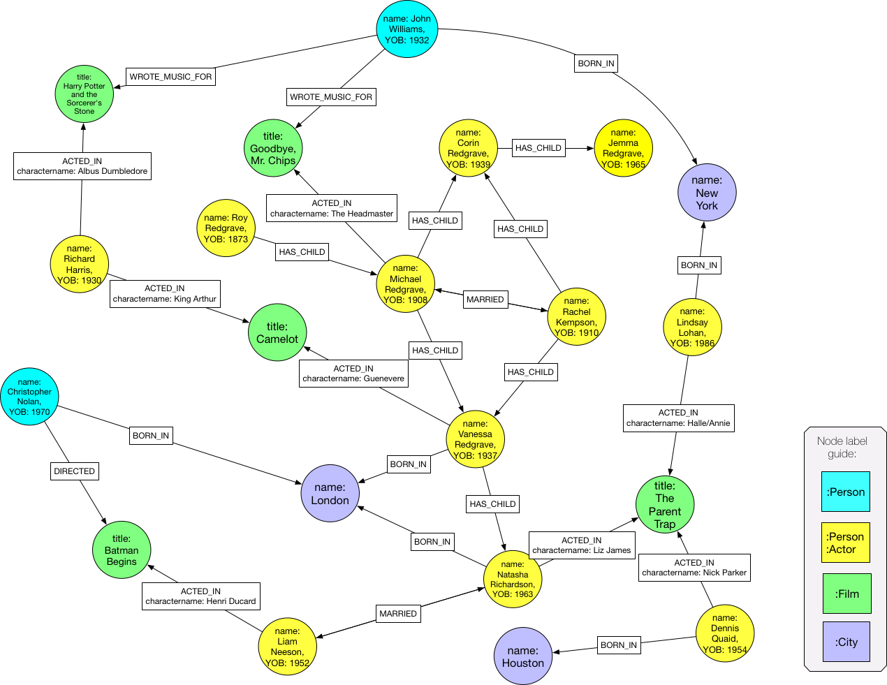
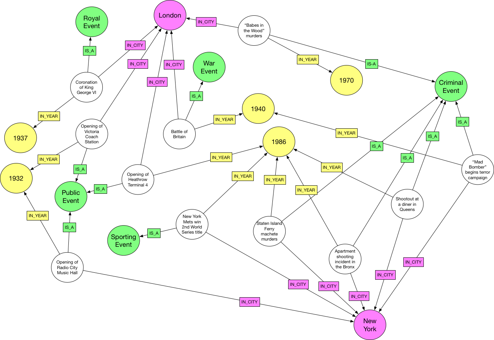
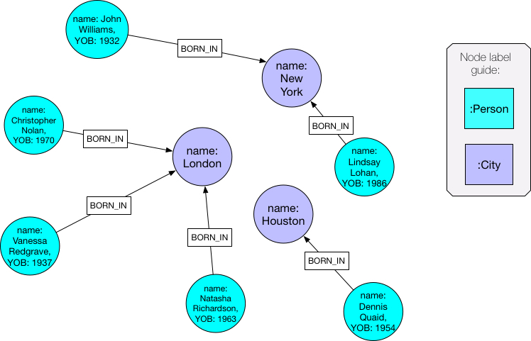
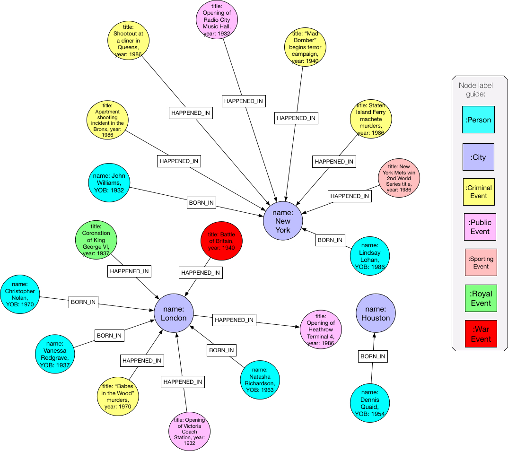
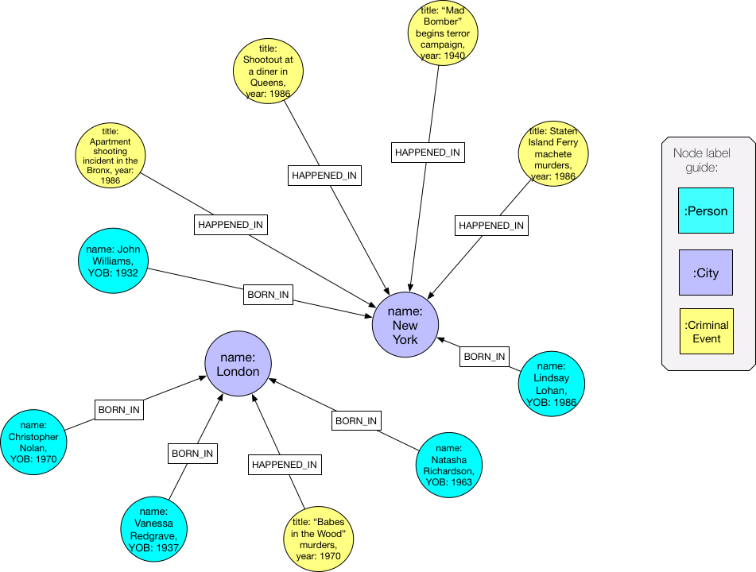

= CIP2017-06-18 - Multiple Graphs
:numbered:
:toc:
:toc-placement: macro
:source-highlighter: codemirror

*Author:* Stefan Plantikow <stefan.plantikow@neotechnology.com>

This material is based on internal contributions of Alastair Green <alastair.green@neotechnology.com>, Mats Rydberg <mats.rydberg@neotechnology.com>, Martin Junghanns <martin.junghanns@neotechnology.com>, Tobias Lindaaker <tobias.lindaaker@neotechnology.com>.

[abstract]
.Abstract
--
This CIP proposes extending Cypher to support the construction, transformation, and querying of multiple graphs (i) by adopting the proposed multiple property graphs model, (ii) by adopting a new execution model, namely the 'multiple graphs execution model', and (iii) by introducing new syntax for working with multiple graphs.
--

toc::[]

== Motivation

Cypher today is a query language for property graphs that provides access to a single, global, implicit graph in order to extract, transform, and return tabular data that is derived from it.
While such returned tabular data may include graph entities (such as nodes and relationships), in essence Cypher as a language is not closed under graphs and as a consequence, Cypher queries are not yet (graph) compositional.

However it seems desirable that a language for property graphs should not only enable querying and updating a selected graph but should also support the construction and transformation of multiple graphs, ideally by utilizing a mechanism for incremental query composition.

Furthermore, adding support for working with multiple graphs has recently been identified as a frequently requested feature:

* It would enable the dynamic construction of graph views (e.g. for access control)
* It would allow reasoning over multiple versions of the same graph (e.g. comparing daily snapshots)
* It would provide an effective grouping mechanism for naturally-partitioned data (e.g. per-continent graph)
* It could be used for combining data from disparate data sources in one system (e.g. in federation and data integration scenarios)
* It fits the paradigm of prominent analytical big-data processing systems (e.g. Apache Spark)
* It mirrors mathematical graph theory where working with multiple graphs is standard

== Background and Overview

This proposal needs to modify and extend different aspects of the language consistently.

We thus provide background material regarding current semantics in line with the different individual sections of this proposal.

== Proposal: Multiple Property Graphs Model

Before proposing changes to the language, it is necessary to first address changes required to the underlying https://github.com/opencypher/openCypher/blob/master/docs/property-graph-model.adoc[*property graph model*].

The revised property graph model used in this CIP is called the *multiple property graphs model* and assumes everything specified in the original property graph model is extended with the notion of multiple, optionally overlapping graphs outlined in the following sub-sections.

=== Model definition

This CIP defines an instance of the *multiple property graphs model* to be a set of property graphs that adhere to the definitions given below.

=== (Property) Graph

_Definition_: A *property graph* is a set of labeled nodes and typed relationships, where each node and relationship contains zero or more properties. A property is a tuple consisting of a named key and value.

Graphs may be updatable, i.e. the set of contained nodes and relationships may change during the lifetime of the graph.
It is an error to attempt to update a read-only graph.

The same node or relationship may be contained within many graphs.
A relationship may only be part of a graph if its start node and its end node are both also contained in the same graph.
Thus, the removal of a node from a graph will require the removal of all of its relationships from the graph.
An entity -- i.e. a node or a relationship -- is considered to be deleted if it is no longer contained within any graph.

=== Graph Addressing

Graphs do not expose an identity in the same way that nodes or relationships do.

Graphs may be made addressable through other means by a conforming implementation, e.g. through exposing the graph via a _graph URL_ for referencing and loading it.
The details regarding the format and choice of graph URLs is beyond the scope of this proposal.

A graph is considered to have been deleted if it is no longer registered under a graph URL and no other reference to it is retained, e.g. from a running query.

== Background: Single Graph Execution Model

Before detailing the foundational changes proposed by this CIP, we will define some basic terms and concepts for describing the state that is manipulated by Cypher's current single graph execution model.

A Cypher query currently takes a set of parameters as input, queries a single, global, implicit property graph, potentially updates it, and finally returns tabular data derived from it.
Query parameters are conceptually thought to be inlined before the start of query execution.
Therefore the *session context* of a whole Cypher query is a single, global, implicit property graph.

Each sequence of clauses (sometimes called a *pipeline*) optionally operates on this single implicit graph and takes a single table input in order to produce a new single table output.
Furthermore, Cypher supports query combinator clauses like `UNION` and `UNION ALL` for merging two pipelines into a single pipeline.
Therefore the *query context* that conceptually is passed between clauses in the single graph execution model is simply a single table.

With this terminology in place, execution of a parameterized Cypher query in the single graph execution model can be described as executing within (and operating on) a given session context and an initial query context and finally returning the query context produced as output for the top-most `RETURN` clause.

Note: This formulation is introduced to describe a high-level model for the execution of queries; a real world implementation is free to choose any other internal representation (e.g. based on an algebra) as long as it does not violate the specified semantics.

== Proposal: Multiple Graphs Execution Model

In the single graph execution model, tabular data serves as the basis of iteration while the single implicit global graph serves as the basis of graph matching and graph manipulation.

This section introduces the *multiple graphs execution model* as an evolution of the *single graph execution model* that enables the addition of features to the language for working with multiple graphs, i.e. it changes the basis of graph matching and graph manipulation.

This CIP proposes the adoption of the multiple graphs execution model by Cypher and to execute existing, single graph queries under this model as outlined below.

=== Model definition

This CIP proposes redefining the *session context* to be

* a set of graphs in the multiple graphs execution model
* a special graph drawn from this set that is called the *default graph*

This CIP proposes redefining the *query context* to be

* a set of named graphs from the *session context*
* *tabular data*, i.e. a potentially ordered bag of records, each having the same fixed set of fields
* a special graph drawn from the *session context* that is called the *source graph*
* a special graph drawn from the *session context* that is called the *target graph*

These redefinitions comprise the multiple graphs execution model.
A parameterized Cypher query under this model can _also_ be described as executing within (and operating on) a given session context and an initial query context and finally returning the query context produced as output for the top-most `RETURN` clause.

As a consequence of adopting the new multiple graphs execution model, the semantics of each clause need to be (re-)defined as to how the execution of the clause transforms all given input query contexts into an output query context.
This CIP preserves all existing semantics by defining how to simulate the single graph execution model in the multiple graphs execution model as outlined below.

=== Partial query contexts

A query context may _not_ return a source graph, a target graph, or even tabular data.
Such a query context is called a *partial query context*.

The following rules are proposed to provide defaults for executing a query (or a clause) on a partial query context:

* If the input query context of a query (or a clause) does not return a source graph, the *provided source graph* of that query is taken to be the default graph.
* If the input query context of a query (or a clause) does not return a target graph, the *provided target graph* of that query is taken to be the default graph.
* If the input query context of a query (or a clause) does not return tabular data, the *provided tabular data* of that query is taken to be a single record without any fields.

These rules ensure that a follow-up query (or a clause) that is executed on a partial query context is always provided with a source graph for graph matching, a target graph for graph manipulation, and tabular data such that it will iterate over at least one row.

=== Query composition

The multiple graphs execution model provides a natural way for the sequential composition of queries:

A query `Q1` whose output signature is an acceptable (in terms of provided bindings) input signature for another query `Q2` may be composed sequentially with `Q2` into a new query `Q3` that first runs `Q1` on the initial query context, next runs `Q2` on the query context returned by `Q1`, and finally returns the query context returned by `Q2`.

This homogenous query composition is enabled by using a uniform query context that is passed between clauses.

Note: The currently drafted https://github.com/opencypher/openCypher/pull/100[subquery CIP] proposes a language addition (e.g. `THEN`) for expressing this kind of query composition directly. In terms of this CIP, `THEN` is simply syntactic sugar for `WITH * GRAPHS *`

=== Query combinators

Query combinators only need to handle tabular query contexts in the single graph execution model.

For the multiple property graphs execution model, it is necessary to define how query combinators combine the query contexts of all child queries into a new result query context (c.f. query composition).

This CIP proposes that the multi-arm query combinators `UNION` (and `UNION ALL` respectively) combine their contexts according to the following rules:

* Tabular data is combined as today, i.e. the tabular result is either a concatenation (`UNION ALL` case) or a distinct union (`UNION` case) of the tabular data from both arms
*  All graphs from both arms are returned; if both arms return a graph with the same name, then the union of those graphs is returned under that shared name
* If both graphs have specified a graph with the same name as their current source graph, then the union of those source graphs under that name again becomes the source graph for further processing.
Otherwise, the default graph becomes the source graph for further processing.
* If both graphs have specified a graph with the same name as their current target graph, then the union of those target graphs under that name again becomes the target graph for further processing.
Otherwise, the default graph becomes the target graph for further processing.

=== Updating queries

This CIP proposes the following update semantics for Cypher with support for multiple graphs:

* All updating clauses update the provided target graph of their current query context.
  More concretely:
  ** Entities are always created in and deleted from the currently provided target graph.
  ** All entities of bound pattern variables in `CREATE` and `MERGE` are always added to the provided target graph of the current query context.
  ** Expressions in `MERGE` are evaluated using the provided target graph of the current query context.
  ** Deleting an entity only affects the provided target graph of the current query context.
* Updating queries always return all variables and graphs in scope, i.e. the behave as if they would end in `RETURN * GRAPHS *` (This syntax is introduced below).
* Semantically, all effects of an updating clause must be made visible before proceeding with the execution of the next clause.
In other words, a conforming implementation must ensure that a later clause always sees the complete set of updates of a preceding updating clause.
* A single update clause may perform multiple conflicting updates on the same node or relationship.
In this situation, the outcome is undefined.
Conflicting updates are considered to be beyond the scope of this CIP and will be addressed in a future proposal.
For now it is proposed that a conforming implementation must choose at least either the original value or one of the values written or `NULL` as the final outcome of a conflicting update.

This CIP proposes allowing `MERGE` to be followed by a non-empty, comma-separated list of bound variables for explicitly adding an entity to the target graph.

=== Simulating the single graph execution model

Execution under the single graph execution model can be simulated in the multiple graphs execution model by executing the query in an session context that uses the single graph as the default graph, and by running it on an empty initial query context.

== Proposal: Multiple Graphs Syntax

This CIP first proposes new syntactical concepts before proceeding to add new and extend existing clauses.

=== Named graphs

This CIP introduces the notion of multiple named graphs.

A graph is referenced in the current query context via its name.
Graph names `<graph-name>` use the same syntax as variable names.
It is an error to use simultaneously the same name for both a regular variable and a graph.

==== Graph references and aliases

An explicit reference to a `<graph-ref>` is just the `<graph-name>` of the graph.
A `<graph-alias>` is a `<graph-ref>` that is followed by `AS <new-graph-name>`.

==== Graph definitions

This CIP defines the notion of a graph definition `<graph-def>` as a means by which to introduce additional named graphs.
This CIP proposes the following kinds of graph definitions:

* `NEW GRAPH <new-graph-name> [AT <graph-url]`: A newly created, empty graph that is to be made available at the provided `<graph-url>`
* `COPY GRAPH <graph-ref> [ TO <graph-url> ] AS <new-graph-name>`: A copy of the given graph `<grap-ref>` that is to be made available as `<new-graph-name>` at the provided `<graph-url>`
* `GRAPH <new-graph-name> AT <graph-url>`: The graph that is available at the provided `<graph-url>`
* `GRAPH <graph-alias>` (i.e. `GRAPH <graph-ref> AS <new-graph-name>`): A new alias for an existing graph
* `SOURCE GRAPH AS <new-graph-name>`: The currently _provided source graph_
* `TARGET GRAPH AS <new-graph-name>`: The currently _provided target graph_
* `DEFAULT GRAPH AS <new-graph-name>`: The _default graph_

Note: The exact shape and form of graph URLs `<graph-url>` lies outside the scope of this CIP.
However, this CIP proposes that a `<graph-url>` must always be given as either a string literal or a query parameter.
This allows parameterization of queries by controlling which graphs from which graph URLs they should use.

==== Graph specifiers

This CIP defines the notion of a graph specifier `<graph-spec>` to be either a `<graph-def>` or the keyword `GRAPH` followed by a `<graph-ref>` or `-` for referring to the default graph without naming it.

=== Introducing multiple graphs

As a first language addition, this CIP proposes syntax for introducing graphs into the current query context:

[source, cypher]
----
FROM < graph-spec >
INTO < graph-spec >
----

==== FROM clause: Change the source and the target graph

This CIP proposes a new `FROM` clause to change both the source and the target graph of the current query context as described.

`FROM <graph-def>` aliases the defined graph to the given `<new-graph-name>`.

`FROM -` may be used to discard the current source and the current target graph.

==== INTO clause: Change the target graph only

This CIP proposes a new `INTO` clause to change the target graph of the current query context as described.

`INTO <graph-def>` aliases the defined graph to the given `<new-graph-name>`.

`INTO -` may be used to discard the current source and the current target graph.

=== Returning, aliasing, and selecting graphs

This CIP proposes to extend both the `WITH` and the `RETURN` clauses with new syntax for controlling the set of available named graphs that should be passed on by the clause (or returned from the query respectively) by explicitly specifying all `<graph-return-items>`.
The newly proposed syntax is:

[source, cypher]
----
WITH < return-items > < graph-return-items >
RETURN < return-items > < graph-return-items >
----

This CIP defines that `<graph-return-items>` is one of:

* `GRAPH -`: All named graphs currently in scope are to be discarded
* `GRAPHS *`: All named graphs currently in scope are to be passed on
* `GRAPHS <graph-alias-list>`: All explicitly listed graphs are to be passed on.
* `GRAPHS *, <graph-alias-list>`: All named graphs currently in scope together with any additionally introduced named graphs from `<graph-alias-list>` are to be passed on

This CIP defines `<graph-alias-list>` as a non-empty, comma-separated list of `<graph-alias>`.

The order of named graphs inherently given by `<graph-return-items>` is semantically insignificant.
However it is recommended that conforming implementations preserve this order at least in programmatic output operations (e.g. a textual display of the list of returned graphs).
This in essence mirrors the semantics for tabular data returned by Cypher.

Both `WITH ... GRAPHS ...` and `RETURN ... GRAPHS ...` will pass on (or return respectively) exactly the set of described named graphs.

Furthermore, this CIP proposes the following shorthands:

* `WITH ...` is to be a shorthand for `WITH ... GRAPHS *`
* `WITH GRAPHS ...` is to be a shorthand for `WITH * GRAPHS ...`
* `RETURN ...` is to be a shorthand for `RETURN ... GRAPHS -`
* `RETURN GRAPHS ...` is to be a shorthand for `RETURN * GRAPHS ...`

=== THEN clause: Discarding available tabular data

This CIP additionally proposes a new `THEN` clause that may be used for discarding all tabular data such that the provided tabular input for the following clause (or query respectively) would again be the provided single record without any fields as specified by the rules for partial query contexts.

Note: This syntax may be used to indicate when the gradual construction of a named graph is finished since neither fields nor the cardinality of tabular data is preserved after this point.

=== Match and merge

This CIP proposes to change the `MATCH` clause with the ability to add all matching entities to the target graph.

Note: If the source and the target graph are the same graph, this will have no effect.

=== Redirecting clauses

This CIP proposes to extend some existing clauses with the ability to use different source and target graphs.

[source, cypher]
----
[ OPTIONAL ] MATCH [ FROM < graph-spec > ] [ INTO < graph-spec > ]
CREATE [ INTO < graph-spec > ] ...
MERGE [ INTO < graph-spec > ] ...
[ DETACH ] DELETE [ FROM < graph-spec > ] ...
SET [ INTO < graph-spec > ] ...
REMOVE [ FROM < graph-spec > ] ...
----

Note: It may seem odd to specify a source graph for clauses like `SET`.
However, the source graph is used to evaluate all expressions (exception: `MERGE`) and therefore being able to override it temporarily may be useful.

=== Nested FROM and INTO subqueries

This CIP proposes the introduction of nested `FROM` and `INTO` subqueries.

These subqueries support changing the source graph or the target graph for a bounded sequence of clauses without changing them for the remainder of the query.
In particular, this additional syntax helps avoid changing the source or the target graph that is returned from the query by limiting the scope of source and target graph changes.

The proposed syntax is:

[source, cypher]
----
FROM < graph-spec > { < graph-construction-subquery > }
INTO < graph-spec > { < graph-construction-subquery > }
----

A `<graph-construction-subquery>` is an updating subquery (i.e. a sequence of clauses, including update clauses) that may or may not end in `RETURN`.
All variables bound before the nested `FROM` and `INTO` subqueries are made visible to the `<graph-construction-subquery>`.
All variables and graphs visible at the end of the `<graph-construction-subquery>` are made visible to the remaining outer query.

These forms have the exact same effect as creating fresh aliases for the current source and target graph, then changing the current source and target graph as specified before executing the given `<graph-construction-subquery>`, and finally restoring the original source and target graphs using the aliases followed by discarding those aliases from the current scope.

=== Query signature declarations

Finally this CIP proposed using the `WITH` clause as the initial clause in a query for declaring all query inputs:

[source, cypher]
----
WITH < return-items > [ < graph-return-items > ]
WITH < graph-return-items >
----

It is proposed that using `WITH` as the initial clause in a query is to be called a *query input declaration* while the use of `RETURN` as the last clause is to be called a *query output declaration*.

Query input declarations are subject to the following limitations:

* All return item expressions are expected to reference an imagined set of input variables from the previous query
* All such referenced variables must be declared or aliased explicitly by another return item unless the query input declaration starts with `WITH *` or `WITH *,`
* If the input query context provides additional, undeclared variables or graphs, those inputs are to be silently discarded

A query that does not start with a query input declaration is assumed to start with `WITH -`, i.e. to run in isolation and to initially read and write to the default graph.

== Grammar

Proposed syntax changes
[source, ebnf]
----
// TODO
----

== Examples

The following examples are intended to show how multiple graphs may be used, and focus on syntax.
We show a fully worked-through example <<complete-example, here>>, describing and illustrating every step of the pipeline in detail.

=== A template for a multiple graph pipeline
[source, cypher]
----
// Query input signature: Records with fields 'a', 'b' and two graphs 'g1', 'g2'
WITH a, b GRAPHS g1, g2

// Sets source and target graph for the following statements by resolving the given physical address
// (The name of this new graph will be system generated)
FROM GRAPH AT 'graph://...'

// Creates and sets new target graph for the following statements at the given physical address
INTO NEW GRAPH result AT 'graph://...'

// Return records with 'a', 'b' and three graphs 'result', 'g1', 'g2' (query output signature)
// Source graph for future reads is again the default graph, the target graph for future writes is 'result'
RETURN a, b GRAPHS result, g1, g2
----

=== A template for pipelining and interleaving queries

[source, cypher]
----
WITH a, b GRAPHS g1, g2 ... // First query
WITH GRAPHS g3, g4 ...      // Second query over first query
RETURN c, d GRAPHS g5       // Third query over second query over first query
----

=== Creating and returning a new graph and columns: a simple example

[source, cypher]
----
FROM GRAPH persons AT 'graph://...'
MATCH (a:Person)-[r:KNOWS]->(b:Person)
MATCH (a)-[:LIVES_IN->(c:City)<-[:LIVES_IN]-(b)
INTO NEW GRAPH berlin
CREATE (a)-[:FRIEND]->(b) WHERE c.name = "Berlin"
INTO NEW GRAPH santiago
CREATE (a)-[:FRIEND]->(b) WHERE c.name = "Santiago"
FROM -
RETURN c.name AS city, count(r) AS num_friends GRAPHS berlin, santiago
----

=== Creating a new graph, switching contexts and returning a graph

[source, cypher]
----
// Set scope to whole social network ...
FROM GRAPH AT 'graph://social-network'
// .. and match some data
MATCH (a:Person)-[:KNOWS]->(b:Person)-[:KNOWS]->(c:Person) WHERE NOT (a)--(c)

// Create a temporary named graph,
INTO NEW GRAPH recommendations
// containing existing nodes and new rels ...
CREATE (a)-[:POSSIBLE_FRIEND]->(c)
// ... and finally discard all tabular data and cardinality
WITH GRAPHS *

// Switch context to named graph.
FROM GRAPH recommendations
MATCH (a:Person)-[e:POSSIBLE_FRIEND]->(b:Person)
// Return tabular and graph output
RETURN a.name, b.name, count(e) AS cnt
    ORDER BY cnt DESC
    GRAPHS recommendations
----

=== Using a pipeline of temporary graphs to process and return a subgraph

[source, cypher]
----
// Set scope to the whole social network ...
FROM GRAPH AT 'graph://social-network'
// .. and match some data.
MATCH (a:Person)-[:IS_LOCATED_IN]->(c:City),
      (c)->[:IS_LOCATED_IN]->(co:Country),
      (a)-[e:KNOWS]-(b)

// Create a new temporary named graph,
INTO NEW GRAPH sn_updated
// add previous matches to new graph,
CREATE (a)-[e]-(b)
// update existing nodes.
SET a.country = cn.name
// ... and finally discard all tabular data and cardinality
WITH GRAPHS *

FROM GRAPH sn_updated
MATCH (a:Person)-[e:KNOWS]->(b:Person)
WITH a.country AS a_country, b.country AS b_country, count(a) AS a_cnt, count(b) AS b_cnt, count(e) AS e_cnt
INTO NEW GRAPH rollup
MERGE (:Persons {country: a_country, cnt: a_cnt})-[:KNOW {cnt: e_cnt}]->(:Persons {country: b_country, cnt: b_cnt})

// Return final graph output
RETURN GRAPHS rollup
----

=== A more complex pipeline: using and persisting multiple graphs

[source, cypher]
----
// Set scope to the whole social network ...
FROM GRAPH AT 'graph://social-network'
// .. and match some data.
MATCH (a:Person)-[e]->(b:Person),
      (a)-[:LIVES_IN]->()->[:IS_LOCATED_IN]-(c:Country {name: ‘Sweden’}),
      (b)-[:LIVES_IN]->()->[:IS_LOCATED_IN]-(c)
// Create a persistent graph at 'graph://social-network/swe'
INTO NEW GRAPH sweden_people AT './swe'
// connecting persons that live in the same city in Sweden.
CREATE (a)-[e]->(b)

// Finally discard all tabular data and cardinality
WITH GRAPHS *

MATCH (a:Person)-[e]->(b:Person),
      (a)-[:LIVES_IN]->()->[:IS_LOCATED_IN]-(c:Country {name: ‘Germany’}),
      (b)-[:LIVES_IN]->()->[:IS_LOCATED_IN]-(c)
// Create a persistent graph at 'graph://social-network/ger'
INTO NEW GRAPH german_people AT './ger'
// connecting persons that live in the same city in Germany.
CREATE (a)-[e]->(b)

// Finally discard all tabular data and cardinality
WITH GRAPHS *

// Start query on the 'sweden_people' graph
FROM GRAPH sweden_people
MATCH p=(a)--(b)--(c)--(a) WHERE NOT (a)--(c)
// Create a temporary graph 'swedish_triangles'
INTO NEW GRAPH swedish_triangles
MERGE p

// and return it together with a count of its content
RETURN count(p) AS num_triangles GRAPHS swedish_triangles, sweden_people, german_people
----

[[complete-example]]
=== A complete example illustrating a data integration scenario

Assume we have two graphs, *ActorsFilmsCities* and *Events*, each of which is contained in a separate location.
This example will show how these two graphs can be integrated into a single graph.

The *ActorsFilmsCities* graph models the following entities:

* Actors and people fulfilling other roles in the film-industry.
* Films in which they acted, or directed, or for which they wrote the soundtrack.
* Cities in which they were born.
* The relationships between family members and colleagues.

Each node is labelled and contains one or two properties (where `YOB` stands for 'year of birth'), and each relationship of type `ACTED_IN` has a `charactername` property indicating the name of the character the relevant `Actor` played in the `Film`.

The other graph, *Events*, models information on events.
Each event is linked to an event type by an `IS_A` relationship, to a year by an `IN_YEAR` relationship, and to a city by an `IN_CITY` relationship.
For example, the _Battle of Britain_ event is classified as a _War Event_, occurred in the year _1940_, and took place in _London_.

In contrast to the *ActorsFilmsCities* graph, *Events* contains no labels on any node, no properties on any relationship, and only a single `value` property on each node.
*Events* can be considered to be a snapshot of data from an RDF graph, in the sense that every node has one and only one value; i.e. in contrast to a property graph, an RDF graph has properties on neither nodes nor relationships.
(For easier visibility, we have coloured accordingly the cities and city-related relationships, event types and event-type relationships, and year and year-related relationships.)

The aims of the data integration exercise are twofold:

* Create and persist to disk (for future use) a new graph, *PersonCityEvents*, containing an amalgamation of data from *ActorsFilmsCities* and *Events*.
*PersonCityEvents* must contain all the event information from *Events*, and only `Person` nodes connected to `City` nodes from *ActorsFilmsCities*.

* Create and return a temporary graph, *Temp-PersonCityCrimes*.
*Temp-PersonCityCrimes* must contain a subset of the data from *PersonCityEvents*, consisting only of the criminal events, their associated `City` nodes, and `Person` nodes associated with the `City` nodes.

==== Step 1

The first action to take in our data integration exercise is to set the source graph to *ActorsFilmsCities*, for which we need to provide the physical address:

[source, cypher]
----
FROM GRAPH ActorsFilmsCities AT 'graph://actors_films_cities...'
----

Next, match all `Person` nodes who have a `BORN_IN` relationship to a `City`:

[source, cypher]
----
MATCH (p:Person)-[:BORN_IN]->(c:City)
----

Create the new graph *PersonCityEvents*, persist it to _some-location_, and set it as the target graph:

[source, cypher]
----
INTO NEW GRAPH PersonCityEvents AT 'some-location'
----

Write the subgraph induced by the `MATCH` clause above into *PersonCityEvents*:

[source, cypher]
----
MERGE (p:Person {name: p.name, YOB: p.YOB})
MERGE (c:City {name: c.name})
MERGE (p)-[:BORN_IN]->(c)
----

Putting all these statements together, we get:

_Query sequence for Step 1_:
[source, cypher]
----
FROM GRAPH ActorsFilmsCities AT 'graph://actors_films_cities...'
MATCH (p:Person)-[:BORN_IN]->(c:City)
INTO NEW GRAPH PersonCityEvents AT 'some-location'
MERGE (p:Person {name: p.name, YOB: p.YOB})
MERGE (c:City {name: c.name})
MERGE (p)-[:BORN_IN]->(c)

//Discard all tabular data and cardinality
WITH GRAPHS *
----

At this stage, *PersonCityEvents* is given by:

==== Step 2

The next stage in the pipeline is to add the events information from *Events* to *PersonCityEvents*.

Firstly, the source graph is set to *Events*, for which we need to provide the physical address:

[source, cypher]
----
FROM GRAPH Events AT 'graph://events...'
----

At this point, the *Events* graph is in scope.

All the events information -- the event itself, its type, the year in which it occurred, and the city in which it took place -- is matched:

[source, cypher]
----
MATCH (c)<-[:IN_CITY]-(e)-[:IN_YEAR]->(y),
      (e)-[:IS_A]->(et {value: 'Criminal Event'})

//Do matches for all other event types: Public Event, War Event....
...
----

The target graph is set to the *PersonCityEvents* graph (created earlier):

[source, cypher]
----
INTO GRAPH PersonCityEvents
----

Using the results from the `MATCH` clause, create a subgraph with more intelligible semantics through the transformation of the events information into a less verbose form through greater use of node-level properties.
 Write the subgraph to *PersonCityEvents*.

[source, cypher]
----
MERGE (c:City {name: c.value})
MERGE (e {title: e.value, year: y.value})
MERGE (e)-[:HAPPENED_IN]->(c)
SET e :WarEvent

//Do for all remaining event types
...
----

Putting all these statements together, we get:

_Query sequence for Step 2_:
[source, cypher]
----
FROM GRAPH Events AT 'graph://events...'
MATCH (c)<-[:IN_CITY]-(e)-[:IN_YEAR]->(y),
      (e)-[:IS_A]->(et {value: 'Criminal Event'})

//Do matches for all other event types: Public Event, War Event....
...
INTO GRAPH PersonCityEvents
MERGE (c:City {name: c.value})
MERGE (e {title: e.value, year: y.value})
MERGE (e)-[:HAPPENED_IN]->(c)
SET e :WarEvent

//Do for all remaining event types
...

//Discard all tabular data and cardinality
WITH GRAPHS *
----

*PersonCityEvents* now contains the following data:

==== Step 3

The last step in the data integration pipeline is the creation of a new, temporary graph, *Temp-PersonCityCrimes*, which is to be populated with the subgraph of all the criminal events and associated nodes from *PersonCityEvents*.

Set *PersonCityEvents* to be in scope:

[source, cypher]
----
FROM PersonCityEvents
----

Next, obtain the subgraph of all criminal events -- i.e. nodes labelled with `CriminalEvent` -- and their associated `City` nodes, and `Person` nodes associated with the `City` nodes:

[source, cypher]
----
MATCH (ce:CriminalEvent)-[:HAPPENED_IN]->(c:City)<-[:BORN_IN]-(p:Person)
----

Create the new, temporary graph *Temp-PersonCityCrimes*, and set it as the target graph:

[source, cypher]
----
INTO NEW GRAPH Temp-PersonCityCrimes
----

Write the subgraph acquired earlier to *Temp-PersonCityCrimes*.

[source, cypher]
----
MERGE (p:Person {name: p.name, YOB: p.YOB})
MERGE (c:City {name: c.name})
MERGE (ce:CriminalEvent {title: ce.title, year: ce.year})
MERGE (p)-[:BORN_IN]->(c)
MERGE (ce)-[:HAPPENED_IN]->(c)
----

Putting all these statements together, we get:

_Query sequence for Step 3_:
[source, cypher]
----
FROM PersonCityEvents
MATCH (ce:CriminalEvent)-[:HAPPENED_IN]->(c:City)<-[:BORN_IN]-(p:Person)
INTO NEW GRAPH Temp-PersonCityCrimes
MERGE (p:Person {name: p.name, YOB: p.YOB})
MERGE (c:City {name: c.name})
MERGE (ce:CriminalEvent {title: ce.title, year: ce.year})
MERGE (p)-[:BORN_IN]->(c)
MERGE (ce)-[:HAPPENED_IN]->(c)

----

And, as the final step of the entire data integration pipeline, return *Temp-PersonCityCrimes*, which is comprised of the following data:

==== Full pipeline

The full data integration query pipeline is given by:

[source, cypher]
----
FROM GRAPH ActorsFilmsCities AT 'graph://actors_films_cities...'
MATCH (p:Person)-[:BORN_IN]->(c:City)
INTO NEW GRAPH PersonCityEvents AT 'some-location'
MERGE (p:Person {name: p.name, YOB: p.YOB})
MERGE (c:City {name: c.name})
MERGE (p)-[:BORN_IN]->(c)

WITH GRAPHS *

FROM GRAPH Events AT 'graph://events...'
MATCH (c)<-[:IN_CITY]-(e)-[:IN_YEAR]->(y),
      (e)-[:IS_A]->(et {value: 'Criminal Event'})

//Do matches for all other event types: Public Event, War Event....
...
INTO GRAPH PersonCityEvents
MERGE (c:City {name: c.value})
MERGE (e {title: e.value, year: y.value})
MERGE (e)-[:HAPPENED_IN]->(c)
SET e :WarEvent

//Do for all remaining event types
...

WITH GRAPHS *

FROM PersonCityEvents
MATCH (ce:CriminalEvent)-[:HAPPENED_IN]->(c:City)<-[:BORN_IN]-(p:Person)
INTO NEW GRAPH Temp-PersonCityCrimes
MERGE (p:Person {name: p.name, YOB: p.YOB})
MERGE (c:City {name: c.name})
MERGE (ce:CriminalEvent {title: ce.title, year: ce.year})
MERGE (p)-[:BORN_IN]->(c)
MERGE (ce)-[:HAPPENED_IN]->(c)

RETURN GRAPHS Temp-PersonCityCrimes
----

== Interaction with existing features

This proposal is far reaching as it changes both the property graph model and the execution model of the language.

However, the change has been carefully designed to not change the semantics of existing queries.

== Alternatives

The scope of this CIP could be reduced by not separating between the source and target graph.

== What others do

SPARQL only provides basic facilities for returning graphs using `CONSTRUCT`.

Neither Gremlin nor PGQL have developed facilities for the direct construction and manipulation of graphs.

== Benefits to this proposal

Cypher is evolved to become a query language that is properly closed under graphs.

== Caveats to this proposal

This is a fundamental and large change to the language whose long-term consequences are difficult to assess.
