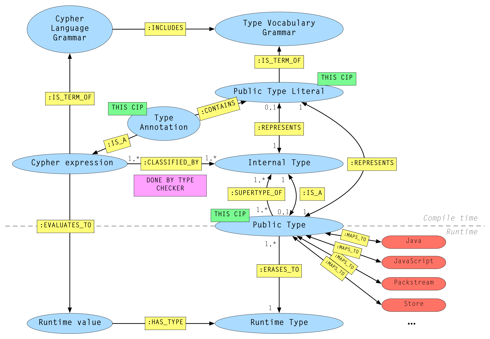

= CIP2015-09-16 Public Type System and Type Annotations
:numbered:
:toc:
:toc-placement: macro
:source-highlighter: codemirror

*Author:* Stefan Plantikow <stefan.plantikow@neotechnology.com>
*Author:* Nigel Small <nigel.small@neotechnology.com>

[abstract]
.Abstract

This CIP specifies the Public Type System of Cypher and introduces literal syntax for writing down types as well as new syntax for type annotations. The proposed type annotation syntax does not change the Cypher grammar right now but rather is intended as a template to be used by future CIPs. This CIP also informatively discusses future syntax that might use the introduced literal type syntax.

toc::[]

== Introduction

=== Background and Motivation

Cypher today has an undocumented internal type system.
In the interest of the http://opencypher.org[openCypher] standardization effort and to enable multiple semantically consistent implementations, it is necessary to specify and document that type system.
Note that this is primarily an exercise of consolidation rather than exploration of the broadest type system we could support.

Furthermore, in order to support currently ongoing work for allowing users to define _stored procedures_, it has become necessary to specify types explicitly within signatures.
This will help with the following:

* In any interaction with an external language, type mapping between the external language and Cypher is necessary.
Any such type mapping must rest on a well defined type system for Cypher in order to be consistent across different implementations.
This applies to interaction via an external language supported by the implementation, as well as interaction via a remote protocol.
* To call user defined procedures from within a larger Cypher query the planner needs to know static type signatures in order to generate efficient plans.
* Statically typed signatures enable implementations to detect possible type errors at query compilation time.
* Statically typed signatures also allow us to add support for procedure overloading in the future.

To support these goals, it is necessary to at least define all valid, supported public types, introduce syntax for them as well as syntax for type annotations.

=== Overview
For the purposes of this CIP, a type system is a system of classifying expressions according to what kinds of values they may evaluate to during the execution of a Cypher query. Furthermore, for a given type system, a type annotation enables annotating terms with type expectations for later re-use in determining the type of other expressions (e.g. when determining the type of a function call expression and its arguments based on type annotations used in function signatures). The type system presented in this CIP does not include a specification of a type inferencing and checking algorithm for Cypher queries (out of scope).

Cypher today has a rich type system that unifies Java implementation types into a coherent type hierarchy and an accompanying type checker that supports rich types with https://en.wikipedia.org/wiki/TypeParameter[type parameters] and https://en.wikipedia.org/wiki/Union_type[union types].
So far it has not been possible to explicitly specify the type of an expression in a query.

This CIP proposes to introduce a well defined type system, syntax for type literals and for type annotations for public types.
Any implementation may choose to incorporate a set of internal types beyond those specified here.
All such internal types must map cleanly onto the public type system and should generally not be made visible to end users.

The details of internal types are out of scope for the purposes of this document.

== Proposal

=== Types and Type Literal Syntax

The section below presents the new Public Type System (PTS) proposed for Cypher.

==== Material and nullable types

The type system provides a way to track nullability, i.e. a type may express if a given expression may be `null` or not.
Tracking (non-)nullability helps an implementation to detect and warn about possible user errors during compile time and it also enables optimizations that rely on values not being `null`. As an example, an implementation may infer that `MATCH` will never introduce a nullable variable, but `OPTIONAL MATCH` will only introduce nullable variables.

Material types are all types that do not permit `null` as a valid result of evaluating the underlying expression.
In the sections below, generally only the material variants of each type are given.

Nullable types are all types that do permit `null` as a valid result of evaluating the underlying expression.
Nullable type names are formed by suffixing a material type name with a single question mark (without in-between whitespace).
Nullable variants of all material types should be supported by any implementation of Cypher.
Note that `null` is not a type but a value that inhabits every nullable type.

Every nullable type is a supertype of its underlying material type, i.e. `T?` is a supertype of `T`.
By transitivity of subtyping, if `S` is a supertype of `T`, then `S?` is also a supertype of `T`.

==== Abstract and concrete types

An _abstract_ type is a type that is not directly associated with a value, and thus may not be instantiated.
This is in contrast to a _concrete_ type.

We observe that any nullable type is also concrete as `null` is a value that is directly associated with it.

==== Any type

The following super types should be supported by any implementation of Cypher:

* `ANY`
** The `ANY` type is the parent of all material types.
** `ANY` is an abstract type.
* `ANY?`
** By definition and as a consequence of subtyping rules for nullable types, `ANY?` is the most generic type available within Cypher and is the supertype of every material and nullable type and the type inhibited by all valid Cypher values.

==== Scalar types

The following scalar types should be supported by any implementation of Cypher, both in the given material and
a nullable variant:

 * `BOOLEAN`
 ** true and false. Note that Cypher uses ternary logic in `WHERE` and hence the type of predicate expressions is generally `BOOLEAN?` with `null` indicating lack of information (the unknown state of ternary logic).
 * `STRING`
 ** Unicode Strings, i.e. `'Cypher'`, and `‘text’`
 * `NUMBER`
 ** Parent of all numeric types (i.e. `INTEGER` and `FLOAT`)
 ** `NUMBER` is an abstract type.
 * `INTEGER`
 ** Exact numbers without decimals, i.e. -3, 0, 4
 * `FLOAT`
 ** IEEE-754 64-bit floating point numbers. Note that defining proper treatment of `NaN` and `Infinity` values has been deferred to a future CIP (out of scope here).

==== Temporal types

The following temporal types should be supported by any implementation of Cypher in accordance with _CIP2015-08-06 - Date and Time_, both in the given material and a nullable variant:

 * `DATETIME`
 ** An instant capturing the date, the time, and the timezone.
 * `LOCALDATETIME`
 ** An instant capturing the date and the time, but not the time zone.
 * `DATE`
 ** An instant capturing the date, but not the time, nor the time zone.
 * `TIME`
 ** An instant capturing the time of day, and the timezone, but not the date.
 * `LOCALTIME`
 ** An instant capturing the time of day, but not the date, nor the time zone.
 * `DURATION`
 ** A temporal amount. This captures the difference in time between two instants. It only captures the amount of time between two instants, it does not capture a start time and end time. A duration can be negative.

==== Container Types

The following container types should be supported by any implementation of Cypher, both in the given material and
a nullable variant:

* `LIST OF T`
** Lists (ordered sequences with random access) of elements of a given material or nullable type `T`. The syntax for a nullable lists of elements of type `T` is `LIST? OF T`. Note that accessing a list by index always yields a value of type `T?` since indexing out of bounds is defined to return `null`.
** `LIST OF T2` is a subtype of `LIST OF T1` if `T2` is a subtype of `T1`. This is a valid subtyping rule since values in Cypher are immutable. Adding an element of type `T` to a `LIST OF S` would produce a new list of type `LIST OF R`, where `R` is the nearest common supertype of `T` and `S`
* `MAP`
** Maps from string keys to values of any type, i.e. `{ name: 'Svensson' }`.
   The type of map values is `ANY?` since it is unknown to the type system if a given map contains a certain key or not.
   Note also that maps distinguish between missing keys and keys that map to a `null` value.
   As an example, that means that `{name: null}` is not equal to `{}`, the empty map.
   A use case where this distinction is particularly important is when setting multiple properties on a node.
   `SET n += {name: null, age: 20}` will remove any existing `name` properties while `SET n += {age: 20}` would leave `name` properties untouched.

==== Graph Types

The following graph types should be supported by any implementation of Cypher, both in the given material and
a nullable variant:

* `NODE`
** A `NODE` is a node in the property graph model with properties, labels, and relationships.
   A node is an entity and a property container.
* `RELATIONSHIP`
** A `RELATIONSHIP` is a relationship in the property graph model with properties, relationship type, a start node, and an end node.
   A relationship is an entity and a property container.
* `PATH`
** A path from a node `n1` to a node `ni` - corresponding to a walk in the graph from `n1` to `ni` - is a sequence `n1`, `r1`, `n2`, `r2`, ..., `r(i-1)`, `ni` of alternating nodes and relationships such that for `1 \<= j < i`, any `rj` contained in the path is incident with `nj` and `n(j+1)`. Additionally, a single node path is a path that starts and ends at the same node `n0` and does not contain any relationships.

=== Type Annotation

To specify the type of a term in future changes to the Cypher grammar, this CIP proposes using the following syntax

[source, ebnf]
----
    term :: type
----

==== Type literal use outside of annotations

Type literals could be used in other production rules as well where this is considered more readable by future CIPs (e.g. in a type test operator like `expr IS NUMBER`).

=== Syntax

[source, ebnf]
----
type annotation = term, "::", type ;

type = nullable core type
     | material core type
     | container type
     ;

nullable core type = material core type, "?"
                   | void type
                   ;

material core type = any type
                   | scalar type
                   | temporal type
                   | graph type
                   ;

any type = "ANY" ;

scalar type = "BOOLEAN"
            | "STRING"
            | "NUMBER"
            | "INTEGER"
            | "FLOAT"
            ;

temporal type = "DATETIME"
              | "LOCALDATETIME"
              | "DATE"
              | "TIME"
              | "LOCALTIME"
              | "DURATION”
              ;

graph type = "NODE"
           | "RELATIONSHIP"
           | "PATH"
           ;

container type = material container type
               | nullable container type
               ;

material container type	= "LIST", "OF", type
                        | "MAP"
                        ;

nullable container type	= "LIST?", "OF", type
                        | "MAP?"
                        ;

keywords = type keywords
         | type keywords, "?"
         | "OF"
         | ...
         ;

type keywords = material core types
              | container type keywords
              ;

container type keywords = "LIST" | "MAP" ;
----

==== Reserved keywords

Besides all introduced type names, this CIP reserves the keyword `OF` for forming literal container types.

=== Semantics

Beyond the subtyping rules specified above, this CIP only provides syntax for future CIPs, it does not directly change Cypher and therefore does not change semantics.

The intended use of type annotations is that they express that the annotated term either has, evaluates to, or is coerced to a value of the annotated type or alternatively gives rise to an expression that does in another context.

=== Interaction with Existing Features

This CIP adds new keywords for all type names.
It is expected that these type name keywords are only valid in specific contexts in the grammar (mostly in type annotations but also possibly in operators).
The likelihood of conflict with existing (or future) production rules is therefore minimal.

== Alternatives

=== Type Literal Syntax
As part of writing this CIP, many syntax alternatives have been considered for type literal syntax:

* Alternative name for the `STRING` type: `TEXT`, `UNICODE`, `LIST<CHAR>`
* Alternative name for the `LIST` type: `ARRAY`, `COLLECTION`, `SEQUENCE`, `VECTOR`
* Alternative syntax for type parameters: `LIST[T]`, `LIST<T>`, `T LIST`
* Alternative syntax for type annotations: `(STRING) expr`, `STRING expr`, `expr: T`
* Alternative syntax for nullable types: `?T`
* Alternative syntax for specifying non-nullable types: `!T`, `T!`

=== Type Annotation Syntax

* Alternative syntax for type annotations: `term: TYPE`
* Alternative syntax for type annotations: `TYPE term`

== What others do

=== SQL
SQL column types are given after the name of the column with no extra punctuation. For example:

[source,sql]
----
id INTEGER
name VARCHAR(40)
----

The SQL standard has adopted the following syntax for casting or converting values:

	   CAST ( <expr> AS <type> )

There are some variations in how different implementations support casting.
This is detailed below.

==== PostgreSQL
Casting in PostgreSQL can be achieved by using cast functions in addition to the AS keyword:

[source,sql]
----
CREATE CAST (source_type AS target_type)
	WITH FUNCTION function_name (argument_type [, ...])
	[ AS ASSIGNMENT | AS IMPLICIT ]

SELECT CAST(42 AS float8);
----

==== MSSQL
MSSQL uses a similar notation to PostgreSQL for casting:

      CAST ( expression AS data_type [ ( length ) ] )

In addition, similar CONVERT and PARSE functions exist:

[source,sql]
----
CONVERT ( data_type [ ( length ) ] , expression [ , style ] )
PARSE ( string_value AS data_type [ USING culture ] )
----

Function type annotations use a similar syntax to column definitions:

     CREATE FUNCTION [dbo].[foo] ( @myNumber INTEGER )

=== SPARQL
SPARQL is based on the type system from RDF and XML schema and provides functionality for type testing and conversion.
It also supports annotating strings with a language.

 * Use in casts: `FILTER(xsd:integer(?time) > 1291908000)`
 * Use in type tests: `FILTER (datatype(?o)=xsd:datetime)`
 * Use in triplet data: `<subject> <predicate> "42"^^xsd:integer .`
 * Use in literals: `"42"^^http://www.w3.org/2001/XMLSchema#integer`
 * Language annotated text: `"cat"@en`

== Benefits to this proposal

* Explicit type syntax allows us to specify the types of arguments and return values in signatures of user defined procedures
* With further extensions it would enable users of Cypher to be more explicit about the types of values which is beneficial for error reporting, planning, performance, and query readability
* Having specified the type system, it becomes feasible to define precise type mappings between external languages
or remote protocol serialization formats and Cypher

== Caveats to this Proposal

Adding explicit syntax for types may lead to a more complex and difficult to learn language.
Since the initial use of type syntax is for specifying the signatures of user defined procedures only, this should not be a strong concern.

== Audience Consultation

Communication with external stakeholders should happen as part of the consultation process for _CIP2015-06-24 Managing Procedures_.

== References

* Wikipedia on https://en.wikipedia.org/wiki/Type_system[Type System]
* CypherType and symbols package object in the Neo4j implementation
* SPARQL and SQL standards

== Appendix

This appendix captures the discussion around type syntax that was part of creating this CIP. It is informative only and not part of the proposal.
It merely documents the authors' ideas for future use of types in Cypher.

=== Internal vs Public Types
We distinguish between internal types and public types to minimize mental overhead and simplify language mapping.
Internal types are tracked by the type checking algorithm.
They may contain more sophisticated static analysis information such as nullability, which properties exist on a node, or alternative types for a value (union types).
A Cypher user commonly should not be required to be aware of internal types though they may influence behavior or become visible in error messages.
Public types contain less information than internal types.
They can be specified in type annotations and there should exist straightforward mappings between the public type system and type systems of target languages of officially supported drivers and the store.

The diagram below gives an overview on the various concepts around the Cypher type system and how they relate to each other as seen by this CIP.

=== Type Mapping
The issue of mapping types from the public type system to other type systems (such as Java, JavaScript or PackStream) is not the concern of this document.
While still requiring clear definition, such mapping definitions are not a Cypher language concern.

=== Type Aliases
Some of the type names are very long and thus could be somewhat difficult to type, and perhaps even read in longer function signatures.
Introducing a set of predefined and perhaps user defined type aliases, such as REL for RELATIONSHIP might be a remedy to this issue.

=== Possible Future Use of Type Syntax

==== Type annotations in declarations and definitions
It may be helpful to extend definitions that introduce new identifiers (WITH, RETURN) or signatures in procedure declarations with type annotations for improved type checking, planning, and possibly code generation.

*Example*
`RETURN expr AS a :: NUMBER`

==== Type ascription ("safe upcast")
A type ascription annotates an expression with a type such that casting the value at runtime to the given type cannot fail.
This may be useful (and in fact is used by Scala for example) to control what types are inferred by a type inferencing algorithm during semantic checking.

*Example*
`RETURN [1.0, 2.3, 3.0] :: LIST OF NUMBER`

==== Type cast ("unsafe downcast")
Beyond type ascription, a type cast asserts a specific type for an expression such that it cannot be verified at compile time if evaluating that expression will always produce a value of the target type.
Hence type casts may fail at runtime.

*Example*
`RETURN CAST n.prop :: NUMBER`

==== Type tests
Additionally it may be practical to test the type of a value at runtime.

*Example*
`RETURN n.prop IS [NOT] NUMBER`

==== Union type support
Cypher's current type checker tracks sets of possible types for expressions.
This could be understood as a form of union typing.
Union types do not map easily to the type systems of most common target languages (Java, Javascript, ...), they complicate type checking, and are not required for type mapping to common external languages.
This is why they have not been included in this proposal.
They could be added instead at a later stage.

*Example*
`RETURN [1, 'Yo'] :: LIST OF (STRING | NUMBER)`
