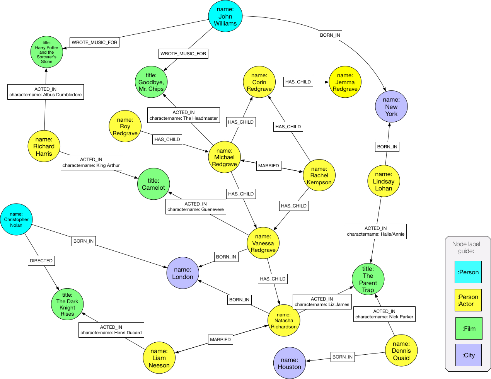

= The openCypher YAGO graph

The openCypher YAGO graph is based on the link:http://www.mpi-inf.mpg.de/departments/databases-and-information-systems/research/yago-naga/yago/[YAGO data set], developed by the link:http://www.mpi-inf.mpg.de/home/[Max Planck Institute for Informatics].
The graph is intended to serve as a common data model for examples detailed in Cypher Improvement Proposals and Requests.

== Data model

The link:http://www.mpi-inf.mpg.de/departments/databases-and-information-systems/research/yago-naga/yago/[YAGO data set] is based on real-world data derived from link:https://www.wikipedia.org/[Wikipedia], link:http://wordnet.princeton.edu/[WordNet] and link:http://www.geonames.org/[Geonames].

The data set is very heterogeneous and rich, containing many different types of entities (such as people, places, events, scientists, actors and so on) and relationship types.
The diversity of the data lends itself well to exemplifying a wide range of queries and scenarios.
Moreover, the data itself is easily understandable -- containing general, tangible, real-world entities -- which makes it an ideal candidate graph to illustrate the various Cypher features proposed.

The graph currently models actors, cities they were born in, films they act in, and their relationships to family and colleagues.
The intention is to enlarge the graph over time by adding further entities and relationship types.

== Distribution

// TODO: Add link to website once deployed

The link:https://github.com/opencypher/openCypher/tree/master/tck/graphs/yago[openCypher YAGO graph], or `oc-yago-graph`, is distributed as a standalone openCypher artifact and as a built-in graph in the link:https://github.com/opencypher/openCypher/tree/master/tck[openCypher TCK].
